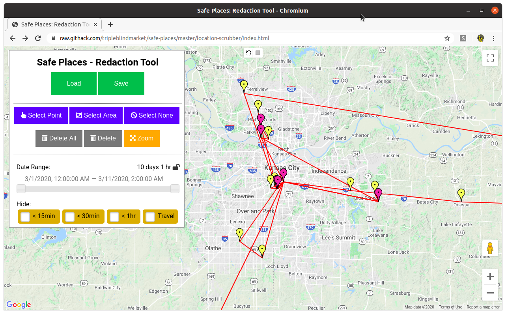
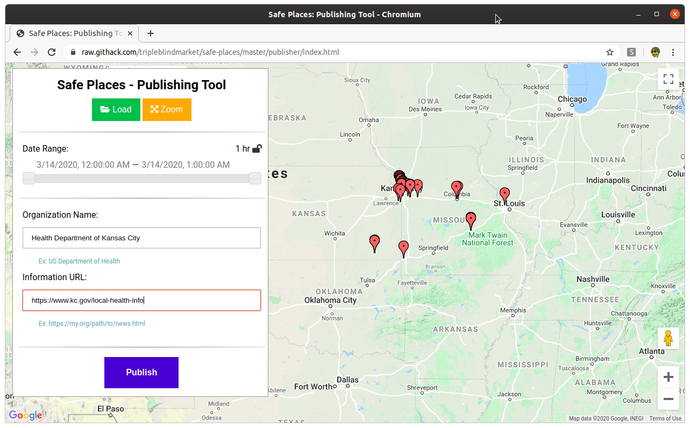

# Safe Places

A toolkit for public health, built on top of data shared by users of [Private Kit](https://github.com/tripleblindmarket/private-kit)

## Server

A server implementation can be easily built to host these tools.  See how in the [Server API documentation](Safe-Places-Server.md).

## Tools

### [Location Viewer/Scrubber](https://raw.githack.com/tripleblindmarket/safe-places/master/location-scrubber/index.html)

Tool to visualize and redact time/location data.  Intended for use in Contact Tracing.

* Input: JSON exported/shared from Private Kit.
* Output: Redacted JSON of time/location data.

NOTE: The app requires a Google Maps Javascript API key to work fully

### [Publisher](https://raw.githack.com/tripleblindmarket/safe-places/master/publisher/index.html)

Tool to combind and publish redacted time/location data files.  Intended for use by Healthcare Authorities.

* Input: Redacted JSON time/location files.
* Output: `safe-paths.json` -- a file ready for posting on a webserver to be consumed by Private Kit : Safe Paths

NOTE: The app requires a Google Maps Javascript API key to work fully

## Running in a Docker container
To be able to run the the Safe-Places Web tool in a container follow the following steps.
To build : 
docker build -t safe-places:latest .
To run : 
docker run --rm -it -p 8080:80 safe-places:latest
Open you browser and load the url http://localhost:8080 